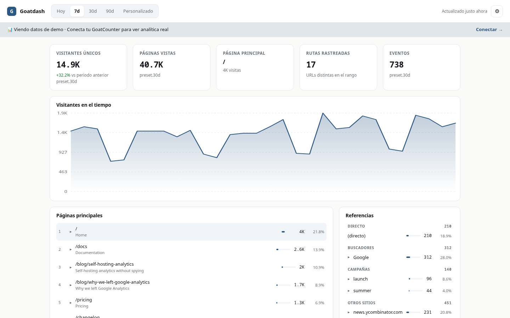
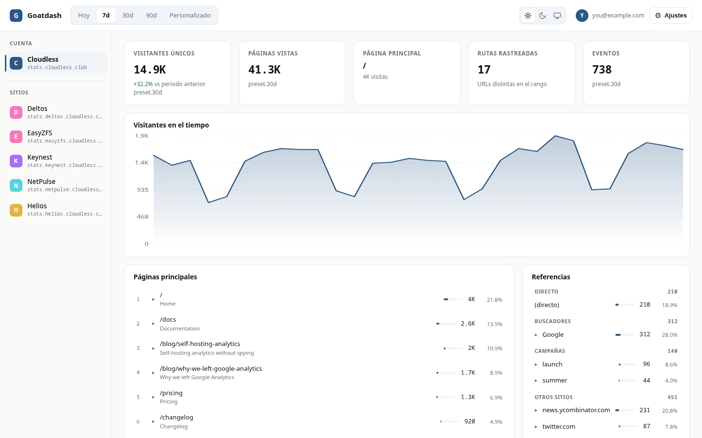
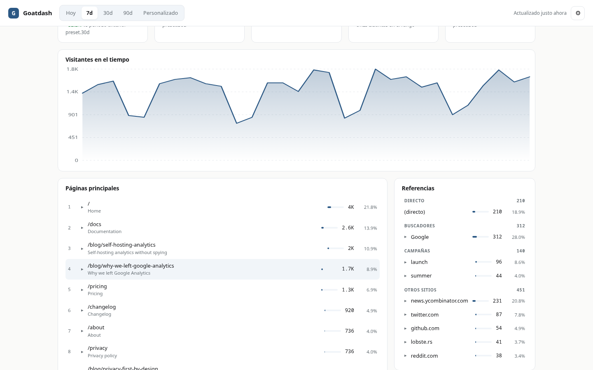
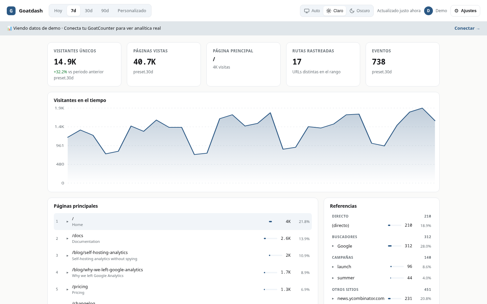

# goatdash

<p align="center">
  <a href="README.es.md">Español</a> |
  <a href="README.md">English</a>
</p>

<p align="center">
  <a href="https://stats.cloudless.club"></a>
  <a href="LICENSE"></a>
  
  
</p>

<h3 align="center">Un dashboard pequeño y privado para GoatCounter.</h3>
<h3 align="center">Sin cookies, sin nube, sin framework, solo ficheros estáticos.</h3>

<p align="center"><a href="https://stats.cloudless.club"><strong>Probar la demo en vivo →</strong></a>&nbsp;&nbsp;·&nbsp;&nbsp;<a href="https://goatdash.cloudless.club">Página de presentación</a>&nbsp;&nbsp;·&nbsp;&nbsp;<a href="#instalación">Ejecutarlo en local</a></p>

<p align="center">
  <picture>
    <source media="(prefers-color-scheme: dark)" srcset="assets/hero-es-dark.png">
    <source media="(prefers-color-scheme: light)" srcset="assets/hero-es-light.png">
    
  </picture>
</p>

goatdash es un dashboard respetuoso con la privacidad para la analítica de [GoatCounter](https://www.goatcounter.com/). Funciona entero en el navegador como JavaScript plano: sin framework, sin CDN, sin paso de build, solo unos pocos ficheros estáticos que hablan con la API v0 de GoatCounter. Empezó como un rewrite de [abhishekhsingh/goatcounter-dashboard](https://github.com/abhishekhsingh/goatcounter-dashboard) (MIT) y creció hasta ser un dashboard multi-sitio que lee varios sitios de GoatCounter, cada uno servido en su propio dominio.

## ¿Por qué existe esto?

Mantengo un puñado de proyectos open source autohospedados, cada uno con su landing (cloudless.club y cinco apps: deltos, easyzfs, keynest, netpulse, helios). Quería analítica a juego con ese montaje: en casa, ligera, sin cuenta en la nube y con el mismo estilo visual que las landings. GoatCounter era el backend evidente, un binario pequeño con SQLite y una API v0 que cubre todo. Lo que faltaba era el frontend.

El goatcounter-dashboard de Abhishekh Singh tenía exactamente el layout que quería, pero cargaba React, Recharts y Babel desde un CDN. Para una página que solo lee una API JSON me pareció un peso innecesario, así que lo reescribí en vanilla JS con mis propios tokens, le añadí ES/EN y un modo demo, y después vino la parte que originó todo esto: el multi-sitio. GoatCounter resuelve el sitio con el header Host, que es su mecanismo core, así que cada uno de mis sitios vive en su propio dominio y el dashboard los consulta directamente, cross-origin. El binario oficial lo hace todo. También propuse aguas arriba un header `X-Goatcounter-Site` en el [PR #915](https://github.com/arp242/goatcounter/pull/915) como opción futura para setups single-origin, pero goatdash no lo necesita. Desde agosto de 2026 está midiendo todo el hub.

## ¿Por qué este stack?

- **Vanilla JS, sin framework, sin CDN**: el original cargaba React, Recharts y Babel desde unpkg. Para una página que lee una API JSON y pinta un par de gráficas, ese es peso que no necesita. Siete ficheros estáticos, nada que compilar, nada que se rompa cuando un CDN cambia de versión.
- **Sin backend propio**: goatdash habla con la API de GoatCounter directamente desde el navegador. No hay servidor que parchear, ni base de datos que respaldar, ni servicio que mantener vivo. Desplegar es copiar ficheros.
- **GoatCounter como backend**: un único binario ligero con SQLite, privacy-first por diseño y trivial de autohospedar. La API v0 ya expone todo lo que muestra el dashboard: totales, páginas, referrers, navegadores, sistemas, tamaños, ubicaciones, idiomas y campañas.
- **Sin patch de backend para el multi-sitio**: GoatCounter resuelve el sitio con el header Host, así que cada sitio vive en su propio dominio y el dashboard lo consulta allí. Un dominio por sitio, todos apuntando al mismo GoatCounter. El binario oficial lo hace todo.
- **Lo que descarté**: un backend propio (otra cosa que mantener), un producto SaaS de analítica (los datos vivirían en el servidor de otro), o el stack React del original (excesivo para esto).

## Características

- **Dashboard multi-sitio**: barra lateral con la cuenta y sus subsitios desde `/api/v0/sites`. Cada sitio se consulta en su propio dominio vía CORS, con el binario oficial de GoatCounter. También funciona con un solo sitio.
- **Alcance de sitios por token**: la barra lateral muestra solo los sitios que la API key puede leer (`token.sites` de `/api/v0/me`), así que cada clave se puede restringir a un subconjunto de sitios.
- **Precache de sitios de la barra lateral**: tras cargar el sitio activo, goatdash calienta en segundo plano la caché del resto de sitios, así que cambiar de sitio es casi instantáneo. Solo pide los endpoints esenciales y se cancela si cambias.
- **Cinco tarjetas de KPI**: visitantes únicos (con tendencia vs el periodo anterior), páginas vistas, página principal, rutas rastreadas y total de eventos, en una rejilla sin huecos.
- **Referrers principales por canal**: referrers globales agrupados en directo, buscadores, campañas y otros sitios, con drill desde cada referrer a las páginas que trajo.
- **Drill en cada tarjeta**: de páginas a sus referrers, de navegadores/sistemas/dispositivos a versiones, de países a regiones, de campañas a sus URLs de referrer.
- **Mapa mundial coroplético**: países sombreados por visitas con escala de raíz cuadrada para que los mercados pequeños sigan visibles, tooltips, leyenda con degradado, zoom, paneo y reset.
- **Rangos flexibles**: hoy, 7d, 30d, 90d o un rango personalizado con fecha de inicio y fin.
- **Tema tri-estado con anti-FOUC**: oscuro, claro o auto, conmutado en la topbar (botones con texto, solo iconos en móvil) y aplicado antes de pintar por un `theme.js` externo que funciona con un CSP estricto `default-src 'self'`.
- **Recargas instantáneas**: un service worker diminuto sirve el shell de la app desde el navegador (HTML network-first para que siempre te llegue la versión desplegada, assets versionados cache-first), y las respuestas de la API se cachean por rango con stale-while-revalidate, así que una recarga pinta en milisegundos incluso con una conexión lenta.
- **Idioma**: UI en ES/EN/Auto, persistida en localStorage.
- **Menú Ajustes con Acerca de**: el menú de engranaje abre Acerca de, que muestra la versión (0.76.0) y un enlace al código fuente.
- **Usuario conectado en la topbar**: un chip con tu avatar y tu email desde `/api/v0/me`.
- **Modo demo**: un clic carga el dashboard completo con datos de ejemplo realistas, sin necesidad de API key.
- **Respeto a la API**: caché de respuesta de 60 segundos, un cliente concurrente pequeño que lee `X-Rate-Limit-Remaining` y `Retry-After` y se adapta para no superar nunca el límite del servidor, reintento por tarjeta e indicador de "actualizado hace Xs".

## Capturas

**Multi-sitio: barra lateral con la cuenta y sus subsitios**

<picture>
  <source media="(prefers-color-scheme: dark)" srcset="assets/screenshot-sidebar-es-dark.png">
  <source media="(prefers-color-scheme: light)" srcset="assets/screenshot-sidebar-es-light.png">
  
</picture>

**Referencias: principales referrers agrupados por canal con drill**

<picture>
  <source media="(prefers-color-scheme: dark)" srcset="assets/screenshot-referrers-es-dark.png">
  <source media="(prefers-color-scheme: light)" srcset="assets/screenshot-referrers-es-light.png">
  
</picture>

**Países: mapa mundial y lista de países principales**

<picture>
  <source media="(prefers-color-scheme: dark)" srcset="assets/geo-es-dark.png">
  <source media="(prefers-color-scheme: light)" srcset="assets/geo-es-light.png">
  
</picture>

## ¿Qué debes esperar?

Es un proyecto personal que uso a diario, no un producto. Es AGPL-3.0 y contesto issues y PRs a mi ritmo, sin SLA. Con colaboraciones o apoyo quizás podría crecer más rápido, pero no puedo prometer nada.

## Instalación

No hay script de instalación ni nada que compilar: goatdash son unos pocos ficheros estáticos. Ponlos en cualquier host estático y abre la página.

```sh
# Prueba en local
python3 -m http.server 8000
# abre http://localhost:8000
```

Para el multi-sitio, cada sitio vive en su propio dominio, todos apuntando al mismo GoatCounter, y GoatCounter resuelve el sitio con el header Host. El dashboard son ficheros estáticos servidos desde su propio dominio y consulta cada sitio cross-origin. Un server block mínimo para el dashboard:

```
server {
  listen 80;
  server_name stats.example.com;

  root /var/www/goatdash;
  index index.html;

  # El index cambia poco; los assets van versionados con ?v=N (ver abajo).
  add_header Cache-Control "no-store";
}
```

Requisitos: cualquier servidor web estático y una instancia de GoatCounter cuya API v0 sea accesible por HTTPS desde el navegador. Sin Docker, sin Node, sin herramientas de build.

### Cache busting

`index.html` carga sus assets con una query de versión, por ejemplo `app.js?v=3`. En cada deploy tienes que subir ese número, o el navegador sigue sirviendo el JavaScript anterior desde su caché de una hora y el dashboard se rompe. Si sirves el index con `Cache-Control: no-store`, el index siempre va fresco y solo los assets versionados se quedan en caché.

### Actualización automática

Si hospedas goatdash en un servidor Linux con systemd, puedes activar el auto-actualizador semanal:

```sh
# Copia los ficheros del updater de la release a un sitio fuera del web root
cp deploy/goatdash-update.sh /opt/goatcounter-dashboard/deploy/
cp deploy/goatdash-update.service /etc/systemd/system/
cp deploy/goatdash-update.timer /etc/systemd/system/

systemctl daemon-reload
systemctl enable --now goatdash-update.timer
```

El timer se ejecuta una vez por semana, descarga la última release estable de GitHub (`v*`), verifica el checksum SHA256 contra `checksums.txt`, hace backup de la carpeta pública actual y la sustituye. El frontend también consulta las releases de GitHub una vez por semana y muestra un banner pequeño cuando hay una versión nueva disponible.

### Content Security Policy

goatdash no carga scripts inline, así que un `default-src 'self'` estricto cubre sus propios ficheros. La única adición es `connect-src`: tiene que incluir todos los dominios de sitio que consulta el dashboard, porque cada sitio es su propio origen.

## Configuración

goatdash no tiene fichero de configuración. En la primera carga, la pantalla de conexión pide dos cosas:

- la **URL de GoatCounter** de tu sitio (por ejemplo `https://stats.cloudless.club`),
- una **API key** creada en GoatCounter en tu usuario, pestaña Settings, sección API, con al menos permisos de Count y Read statistics.

Ambas se guardan en el localStorage del navegador y solo viajan a tu instancia de GoatCounter por HTTPS. El tema, el idioma, el sitio seleccionado y el rango se persisten igual.

### Multi-sitio entre dominios

Para varios sitios en una misma cuenta de GoatCounter, cada sitio necesita su propio dominio, y todos los dominios apuntan al mismo GoatCounter. GoatCounter resuelve el sitio con el header Host, que es su mecanismo core, así que el binario oficial es suficiente. El dashboard lee la lista de sitios de `/api/v0/sites` y consulta cada sitio en `https://<su-dominio>/api/...`.

GoatCounter envía `Access-Control-Allow-Origin: *`, así que las peticiones cross-origin funcionan sin proxy. Un detalle honesto: cada petición cross-origin que lleva el header `Authorization` dispara antes un preflight `OPTIONS`, así que cada llamada a la API son dos round trips.

Propuse aguas arriba un header `X-Goatcounter-Site` en el [PR #915](https://github.com/arp242/goatcounter/pull/915). Permitiría que un solo origen sirviera todos los sitios, pero goatdash no lo necesita. Hasta que entre, un dominio por sitio es todo lo que hace falta.

## Uso

Abre la página y pulsa **Probar demo** para explorarla con datos de ejemplo, o introduce tu URL de GoatCounter y tu API key para conectar. La barra lateral lista la cuenta y sus subsitios, el control segmentado cambia entre hoy/7d/30d/90d/personalizado, y el menú de engranaje guarda actualizar, tema, idioma y desconectar.

Pulsa casi cualquier cosa para hacer drill: una página muestra sus referrers, un referrer muestra las páginas que trajo, un navegador muestra versiones, un país muestra regiones, una campaña muestra sus URLs. El menú de actualizar limpia la caché y vuelve a pedirlo todo.

## Desarrollo

goatdash es HTML, CSS y JavaScript planos, repartidos entre `index.html`, `styles.css`, `theme.js`, `app.js`, `fixtures.js` y `sw.js`. Sin package.json, sin bundler, sin harness de tests en el repo; los datos de demo viven en `fixtures.js` y reflejan la forma real de las respuestas de la API.

```sh
# Sirve el repo y abre http://localhost:8000
python3 -m http.server 8000
```

Los datos del mapa mundial en `assets/world-map.js` son un asset generado que se conserva del proyecto original; el generador vive aguas arriba en la carpeta `scripts/` de abhishekhsingh/goatcounter-dashboard y solo hay que ejecutarlo cuando cambie el dataset de países.

## Agradecimientos

goatdash no se vería como se ve sin el [goatcounter-dashboard de Abhishekh Singh](https://github.com/abhishekhsingh/goatcounter-dashboard) (MIT): el layout, el patrón de drill y la idea del modo demo vienen de allí. El asset del mapa mundial (`assets/world-map.js`) se conserva tal cual de ese proyecto. El resto es un rewrite limpio en vanilla, pero la referencia merece el crédito.

## Licencia

AGPL-3.0, ver [LICENSE](LICENSE). El asset del mapa mundial (`assets/world-map.js`) se conserva tal cual del proyecto MIT de Abhishekh Singh y sigue siendo MIT; su aviso vive en [LICENSE.world-map](LICENSE.world-map).

Construido por gnacho como proyecto personal autohospedado; issues y PRs son bienvenidos.
