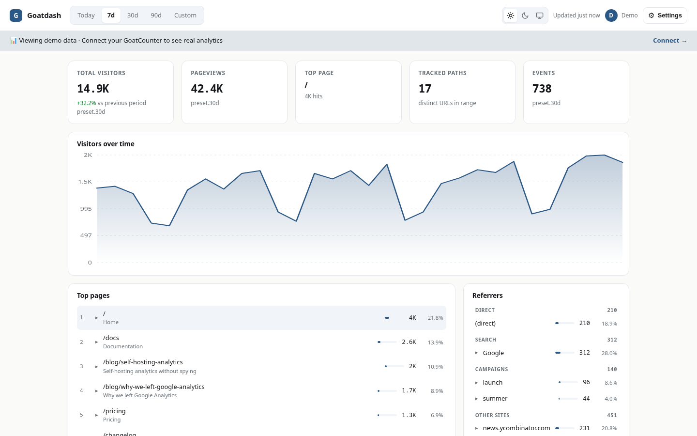
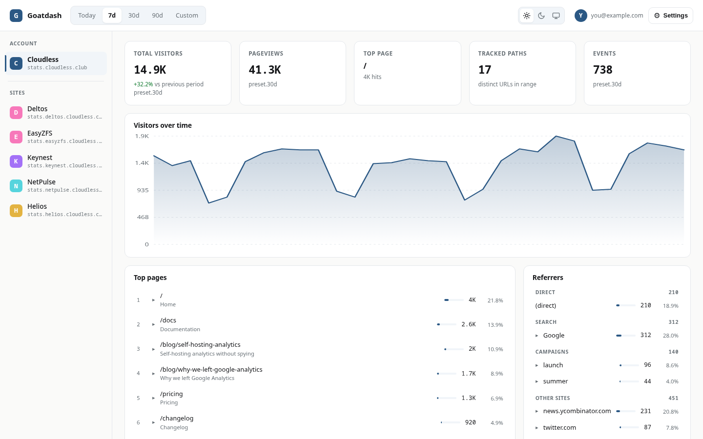
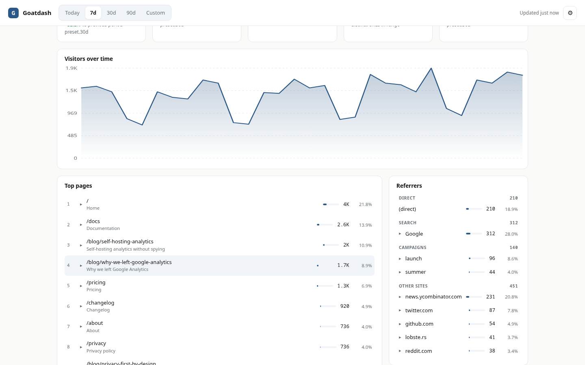
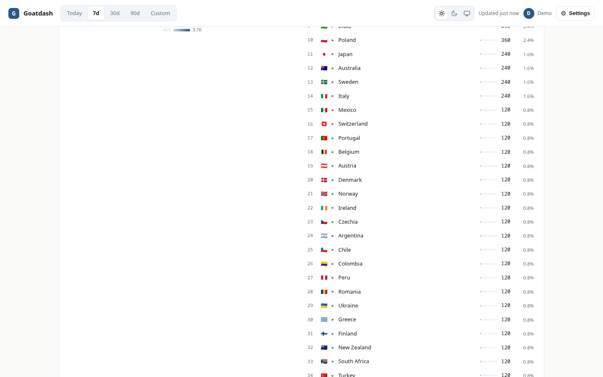

# goatdash

<p align="center">
  <a href="README.md">English</a> |
  <a href="README.es.md">Español</a>
</p>

<p align="center">
  <a href="https://stats.cloudless.club"></a>
  <a href="LICENSE"></a>
</p>

<p align="center">
  <picture>
    <source media="(prefers-color-scheme: dark)" srcset="assets/hero-en-dark.png">
    <source media="(prefers-color-scheme: light)" srcset="assets/hero-en-light.png">
    
  </picture>
</p>

goatdash is a privacy-friendly dashboard for [GoatCounter](https://www.goatcounter.com/) analytics. It runs entirely in the browser as plain JavaScript: no framework, no CDN, no build step, just a few static files that talk to the GoatCounter v0 API. It started as a rewrite of [abhishekhsingh/goatcounter-dashboard](https://github.com/abhishekhsingh/goatcounter-dashboard) (MIT) and grew into a multi-site dashboard that reads several GoatCounter sites, each served at its own domain.

## Why does this exist?

I run a small set of self-hosted open source projects, each with its own landing page (cloudless.club and five apps: deltos, easyzfs, keynest, netpulse, helios). I wanted analytics to match that setup: self-hosted, light, no cloud account, in the same visual style as the landings. GoatCounter was the obvious backend, one small binary with SQLite and a v0 API that covers everything. The missing piece was the frontend.

Abhishekh Singh's goatcounter-dashboard had exactly the layout I wanted, but it loaded React, Recharts and Babel from a CDN. For a page that just reads a JSON API that felt heavy, so I rewrote it in vanilla JS with my own tokens, added ES/EN and a demo mode, and later the part that started all this: multi-site. GoatCounter resolves the site from the Host header, which is core behavior, so each of my sites lives at its own domain and the dashboard queries them directly, cross-origin. The official binary does all of it. I also proposed an `X-Goatcounter-Site` header upstream in [PR #915](https://github.com/arp242/goatcounter/pull/915) as a future option for single-origin setups, but goatdash does not need it. It has been tracking the whole hub since August 2026.

## Why this stack?

- **Vanilla JS, no framework, no CDN**: the original loaded React, Recharts and Babel from unpkg. For a page that reads one JSON API and draws a few charts, that is weight it does not need. Six static files, nothing to build, nothing to break when a CDN bumps a version.
- **No backend of my own**: goatdash speaks the GoatCounter API directly from the browser. There is no server to patch, no database to back up, no service to keep alive. Deployment is copying files.
- **GoatCounter as the backend**: a single lightweight binary with SQLite, privacy-first by design and trivial to self-host. The v0 API already exposes everything the dashboard shows: totals, pages, referrers, browsers, systems, sizes, locations, languages and campaigns.
- **No backend patch for multi-site**: GoatCounter resolves the site from the Host header, so each site lives at its own domain and the dashboard queries it there. One domain per site, all pointing at the same GoatCounter. The official binary does everything.
- **What I did not pick**: a backend of my own (another thing to maintain), a SaaS analytics product (the data would live on someone else's server), or the original's React stack (overkill for this).

## Features

- **Multi-site dashboard**: sidebar with the account and its subsites from `/api/v0/sites`. Each site is queried at its own domain over CORS, using the official GoatCounter binary. Works for one site too.
- **Sidebar site precache**: after the active site loads, goatdash warms the cache for the other sites in the background, so switching sites is almost instant. It only fetches the essential endpoints and cancels if you switch.
- **Five KPI cards**: unique visitors (with trend vs the previous period), pageviews, top page, tracked paths and total events, in a gapless grid.
- **Top referrers by channel**: global referrers grouped into direct, search engines, campaigns and other sites, with a drill-down from each referrer to the pages it brought.
- **Drill-down on every card**: pages to their referrers, browsers/systems/devices to versions, countries to regions, campaigns to their referrer URLs.
- **Choropleth world map**: countries shaded by visits with a square-root scale so small markets stay visible, plus hover tooltips and a gradient legend.
- **Flexible ranges**: today, 7d, 30d, 90d or a custom start/end date.
- **Tri-state theme with anti-FOUC**: dark, light or auto, switched with sun/moon/monitor icons in the topbar and applied before paint by an external `theme.js` script that works with a strict `default-src 'self'` CSP.
- **Language**: ES/EN/Auto UI, persisted in localStorage.
- **Settings menu with About**: the gear menu opens About, which shows the version (0.2.0) and a link to the source.
- **Signed-in user in the topbar**: a chip with your avatar and email from `/api/v0/me`.
- **Demo mode**: one click loads the full dashboard with realistic sample data, no API key needed.
- **Polite to the API**: 60-second response cache, a small concurrent client that reads `X-Rate-Limit-Remaining` and `Retry-After` and adapts so it never exceeds the server limit, per-card retry and an "updated Xs ago" freshness indicator.

## Screenshots

**Multi-site: sidebar with the account and its subsites**

<picture>
  <source media="(prefers-color-scheme: dark)" srcset="assets/screenshot-sidebar-en-dark.png">
  <source media="(prefers-color-scheme: light)" srcset="assets/screenshot-sidebar-en-light.png">
  
</picture>

**Referrers: top referrers grouped by channel with a drill-down**

<picture>
  <source media="(prefers-color-scheme: dark)" srcset="assets/screenshot-referrers-en-dark.png">
  <source media="(prefers-color-scheme: light)" srcset="assets/screenshot-referrers-en-light.png">
  
</picture>

**Countries: world map and top country list**

<picture>
  <source media="(prefers-color-scheme: dark)" srcset="assets/geo-en-dark.png">
  <source media="(prefers-color-scheme: light)" srcset="assets/geo-en-light.png">
  
</picture>

## What to expect?

This is a personal project that I use every day, not a product. It stays MIT, and I answer issues and PRs at my own pace, with no SLA. With contributions or support it might grow faster, but I cannot promise anything.

## Installation

There is no install script and nothing to compile: goatdash is a handful of static files. Put them on any static host and open the page.

```sh
# Try it locally
python3 -m http.server 8000
# open http://localhost:8000
```

For multi-site, each site lives at its own domain, all pointing at the same GoatCounter, and GoatCounter resolves the site from the Host header. The dashboard is just static files served from its own domain and queries each site cross-origin. A minimal server block for the dashboard:

```
server {
  listen 80;
  server_name stats.example.com;

  root /var/www/goatdash;
  index index.html;

  # The index changes rarely; assets are versioned with ?v=N (see below).
  add_header Cache-Control "no-store";
}
```

Requirements: any static web server and a GoatCounter instance whose v0 API is reachable over HTTPS from the browser. No Docker, no Node, no build tools.

### Cache busting

`index.html` loads its assets with a version query, for example `app.js?v=3`. On every deploy you must bump that number, or the browser keeps serving the previous JavaScript from its one hour cache and the dashboard breaks. If you serve the index with `Cache-Control: no-store`, the index itself is always fresh and only the versioned assets stay cached.

### Content Security Policy

goatdash loads no inline scripts, so a strict `default-src 'self'` covers its own files. The one addition is `connect-src`: it must include every site domain the dashboard queries, because each site is its own origin.

## Configuration

goatdash has no config file. On first load the connect screen asks for two things:

- the **GoatCounter URL** of your site (for example `https://stats.cloudless.club`),
- an **API key** created in GoatCounter under your user, Settings, API tab, with at least Count and Read statistics permissions.

Both are kept in the browser's localStorage and only travel to your GoatCounter instance over HTTPS. Theme, language, selected site and date range are persisted the same way.

### Multi-site across domains

For several sites on one GoatCounter account, each site needs its own domain, and every domain points at the same GoatCounter. GoatCounter resolves the site from the Host header, which is core behavior, so the official binary is enough. The dashboard reads the site list from `/api/v0/sites` and queries each site at `https://<its-domain>/api/...`.

GoatCounter sends `Access-Control-Allow-Origin: *`, so the cross-origin requests work without a proxy. One honest detail: every cross-origin request that carries the `Authorization` header first triggers an `OPTIONS` preflight, so each API call is two round trips.

I proposed an `X-Goatcounter-Site` header upstream in [PR #915](https://github.com/arp242/goatcounter/pull/915). It would let a single origin serve every site, but goatdash does not need it. Until that lands, one domain per site is all it takes.

## Usage

Open the page and click **Try Demo** to explore with sample data, or enter your GoatCounter URL and API key to connect. The sidebar lists the account and its subsites, the segmented control switches between today/7d/30d/90d/custom, and the gear menu holds refresh, theme, language and disconnect.

Click almost anything to drill down: a page shows its referrers, a referrer shows the pages it brought, a browser shows versions, a country shows regions, a campaign shows the referrer URLs. The refresh menu clears the cache and fetches everything again.

## Development

goatdash is plain HTML, CSS and JavaScript, split across `index.html`, `styles.css`, `theme.js`, `app.js` and `fixtures.js`. No package.json, no bundler, no test harness in the repo; the demo data lives in `fixtures.js` and mirrors the real API response shape.

```sh
# Serve the repo and open http://localhost:8000
python3 -m http.server 8000
```

The world map data in `assets/world-map.js` is a generated asset kept from the original project; the generator lives upstream in the `scripts/` folder of abhishekhsingh/goatcounter-dashboard and only needs to run when the country dataset changes.

## Thanks

goatdash would not look the way it does without [Abhishekh Singh's goatcounter-dashboard](https://github.com/abhishekhsingh/goatcounter-dashboard) (MIT): the layout, the drill-down pattern and the demo mode idea all come from there. The world map asset (`assets/world-map.js`) is kept verbatim from that project. The rest is a clean vanilla rewrite, but the reference deserves the credit.

## License

MIT, see [LICENSE](LICENSE). The LICENSE retains the original copyright notice of Abhishekh Singh's goatcounter-dashboard, which goatdash builds on.

Built by gnacho as a personal self-hosted project; issues and PRs are welcome.
